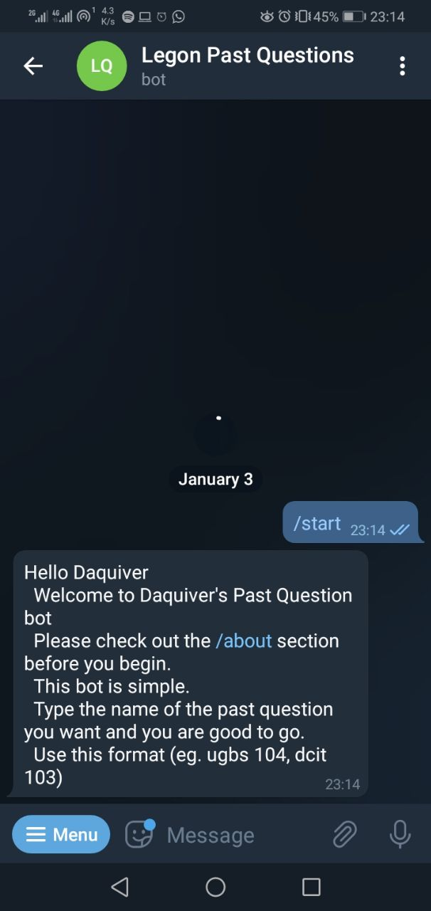
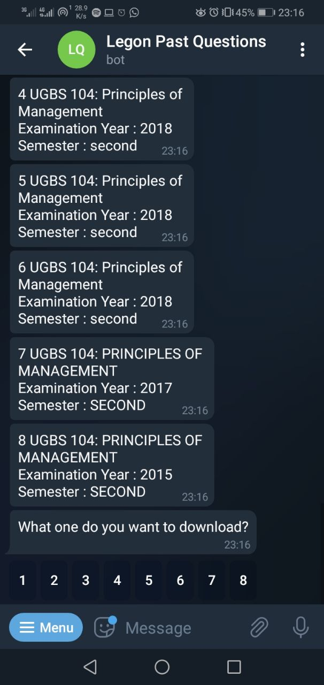
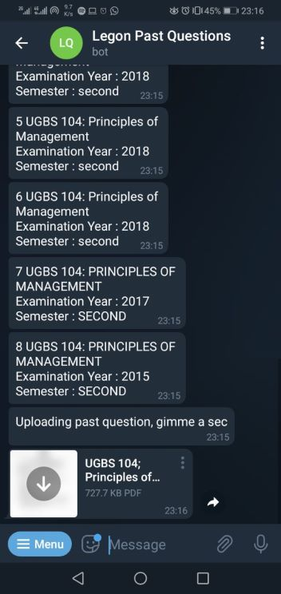

# Legon Past Questions Bot

## Unofficial telegram bot for Legon

This is a Python-based Telegram bot designed for the University of Ghana. It enables users to crawl the university's past questions page, search for a specific past question, and return it based on their selection. The bot integrates several powerful libraries, including Python-Telegram-Bot, Selenium, BeautifulSoup4, to provide seamless functionality.

## Access

You can find the bot on <https://t.me/legon_pasco_bot>.

## Prerequisites

Before running the script, please make sure you have the following:

* A telegram token and a telegram bot. Get it from @botfather on telegram.
* A username(student ID) and a password to access the site. Get it from the [Balme library(Legon)](https://balme.ug.edu.gh/index.php/services/past-exam-papers-access-registration).
* If you are using the webhooks option and not polling(local host), you'll need a url from your hosting server.

## Getting Started

1. Clone the repository:

    ```python
    git clone https://github.com/Daquiver1/past_questions_bot
    ```

2. Change to the project directory:

    ```python
    cd past_questions_bot
    ```

3. Install the required dependencies:

   ```python
    pip install -r requirements.txt
    ```

4. Rename the `.env.template` file to `.env` and update the environment variables with your own values.
5. Run unit tests.

    ```python
    python -m unit -v
    ```

6. Run integration tests.

    ```python
    python -m integration -v 
    ```

7. Run the python file with the following command:

    ```python
    python src/main.py
    ```

8. `The app is now running.`

## Bot Preview






## TODO

* [ ] Include files in the next page.
* [X] Add an all feature which will download all the available past questions specified.
* [X] Let the options be displayed in one message instead of a plethora of messages.
* [X] Add test cases.
* [ ] Cache all files downloaded to avoid downloading them again.
* [ ] Integrate with an s3 bucket to store all downloaded files.
* [ ] Integrate Datadog for monitoring.

## Contributing

Contributions are welcome! If you encounter any issues or have suggestions for improvements, please create an issue or submit a pull request.

## Contact

[](mailto:cabrokwa11@gmail.com)
[](https://www.linkedin.com/in/daquiver/)
[](https://twitter.com/daquiver1) [](https://daquiver.medium.com)

---------

```python

if youEnjoyed:
    starThisRepository()

```
